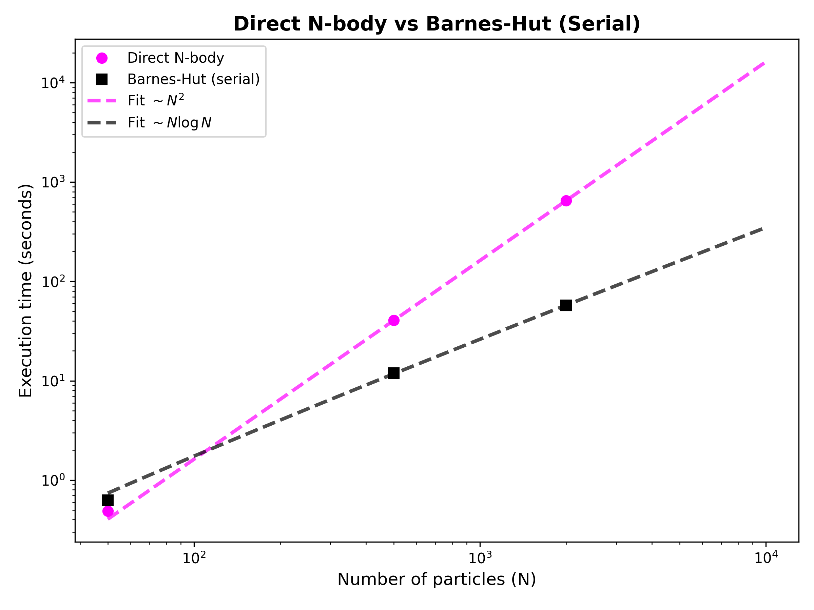
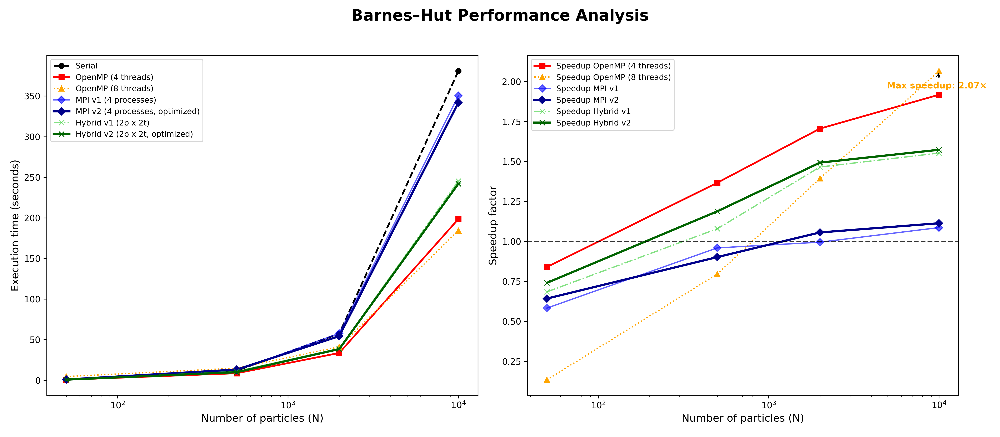

# BARNES-HUT SIMULATION: PARALLEL IMPLEMENTATIONS IN *FORTRAN* (MPI & OpenMP)
<span style="font-size:1.5em;">Álvaro Cascales Hernández</span>

This project implements a gravitational N-body simulation accelerated using the **Barnes-Hut algorithm**. The core simulation is written in modern *Fortran* and leverages high-performance computing techniques, including shared-memory parallelism (**OpenMP**), distributed-memory parallelism (**MPI**), and hybrid approaches. A *Python* visualization tool is included to analyze the resulting trajectories.

## The Barnes-Hut algorithm

The direct summation method for N-body problems has a computational complexity of $O(N^2)$, making it prohibitively expensive for large numbers of particles. The Barnes-Hut algorithm reduces this complexity to $O(N \log N)$ by approximating the forces exerted by distant clusters of particles.

### Key concepts:
1.  **Octree structure:** The 3D simulation space is recursively divided into 8 sub-cubes (octants) until each leaf node contains at most one particle.
2.  **Center of mass:** Each internal node of the tree stores the total mass and the center of mass of all particles contained within its volume.
3.  **Opening criterion ($\theta$):** When computing the force on a particle, the algorithm traverses the tree. If an internal node (cell) is sufficiently far away—determined by the ratio of the cell size to the distance ($l/d < \theta$)—the cell is treated as a single point mass located at its center of mass. Otherwise, the algorithm recursively opens the cell to resolve its children.

---

## Project structure

The codebase is organized into modular components to ensure extensibility and clarity. Below is a detailed description of each module:

### Core modules

-   **`geometry.f90`**
    Defines fundamental data types such as `point3d` and `vector3d`. It overloads arithmetic operators (`+`, `-`, `*`, `/`) to allow intuitive vector mathematics (e.g., `vec_a + vec_b`) and includes utility functions like `distance2` for efficient squared-distance calculations.

-   **`particle.f90`**
    Defines the `particle3d` type, which encapsulates the physical state of a body: mass, position, and velocity. It serves as the basic building block for the simulation arrays.

-   **`io_module.f90`**
    Handles all file input/output operations. It ensures a consistent format for reading initial conditions (`input.dat`) and writing simulation snapshots (`output.dat`), keeping the I/O logic separate from the physics engine.

### Barnes-Hut implementation modules

-   **`barnes_hut_module.f90` (Serial / OpenMP)**
    This is the reference implementation for Shared Memory systems.
    *   **Tree management:** Contains routines to build the octree from scratch (`barnes_hut_initialize`), rebuild it at every time step (`barnes_hut_rebuild`), and prune empty nodes (`borrar_empty_leaves`).
    *   **Force calculation:** The `barnes_hut_calculate_forces` subroutine computes the net acceleration. It is annotated with OpenMP directives*(`!$omp parallel do schedule(dynamic)`), allowing the loop to be executed in parallel by multiple threads. The `dynamic` scheduling is crucial here to handle the load imbalance caused by the irregular tree structure.
    *   **Versatility:** This single module supports both serial execution (1 thread) and parallel execution (N threads) depending on the environment configuration.

-   **`barnes_hut_mpi_module.f90` (MPI v1 - Encapsulated & Hybrid)**
    A Distributed Memory implementation based on standard coursework references.
    *   **Encapsulation:** It hides the complexity of MPI communication within the module. The subroutine `barnes_hut_sync_particles` manages internal buffers (`comm_sendbuf`, `comm_recvbuf`) and calls `MPI_Allgatherv` to synchronize particle positions across all processes.
    *   **Hybrid support:** Like the V2 and serial versions, the force calculation loop contains OpenMP directives. This means V1 can also be run in Hybrid mode (MPI + OpenMP), although the communication buffers are allocated/deallocated internally at each step.
    *   **Logic:** It follows a **Particle Decomposition** strategy where every process builds the entire tree locally (Replicated Tree) but computes forces for only a subset of particles.

-   **`barnes_hut_mpi_module_v2.f90` (MPI v2 - Optimized & Hybrid)**
    An optimized version refactored for better performance and explicit memory control.
    *   **Decoupled communication:** Unlike v1, this module **does not** contain the MPI communication routines. The synchronization logic has been moved to the main program (`main_mpi_v2.f90`), allowing for explicit control over memory buffers (`sendbuf`, `recvbuf`) and timing. This reduces the overhead of repetitive allocation inside the module.
    *   **Hybrid ready:** The force calculation subroutine accepts start/end indices (`istart`, `iend`) to work on a subset of particles, while retaining the OpenMP directives internally. This design enables Hybrid parallelism (MPI processes + OpenMP threads) seamlessly.

### Main Drivers

-   **`main.f90` (Serial/OpenMP)**
    The standard driver for shared memory. It reads input parameters, builds the initial tree, and executes the time loop using the Leapfrog integrator. It calls `barnes_hut_calculate_forces` which automatically leverages OpenMP threads if compiled with `-fopenmp`.

-   **`main_mpi.f90` (MPI v1)**
    Driver for the encapsulated MPI version. It initializes the MPI environment, distributes particle counts among processes, and relies on `barnes_hut_sync_particles` from the v1 module to handle data exchange at each step. It supports hybrid execution if the `Makefile` compiles it with OpenMP flags.

-   **`main_mpi_v2.f90` (MPI v2 - Optimized)**
    Driver for the optimized/hybrid version. It explicitly manages the `MPI_Allgatherv` communication in the main loop, packing and unpacking particle data buffers (`pack_subset_particles`, `unpack_all_particles`). It detects if `USE_OMP` is defined to report Hybrid mode status (MPI ranks + OpenMP threads per rank).

---

## How to use the simulator

### 1. Prerequisites
Ensure the following tools are installed:
-   **Gfortran** (or compatible Fortran compiler)
-   **MPI implementation** (e.g., MPICH or OpenMPI)
-   **Python 3** with `numpy`, `matplotlib`, `scipy` (for complexity analysis) and `ffmpeg` (for video generation).

### 2. Compilation
The project includes a robust `Makefile` with multiple targets.

*   **Compile everything:**
    ```bash
    make all
    ```
*   **Compile specific versions:**
    *   `make serial`: Generates `barnes_hut_serial`.
    *   `make omp`: Generates `barnes_hut_omp`.
    *   `make mpi1`: Generates `barnes_hut_mpi1`.
    *   `make mpi2`: Generates `barnes_hut_mpi2`.
    *   `make hybrid1`: Generates `barnes_hut_hybrid1` (MPI + OpenMP using V1).
    *   `make hybrid2`: Generates `barnes_hut_hybrid2` (MPI + OpenMP using V2).

*   **Clean build artifacts:**
    ```bash
    make clean
    ```

### 3. Input generation (rotating disks)
The project includes a generator program `generate_input_disk.f90` that creates a physically stable initial condition: a thin rotating disk around a massive central body (simulating a galactic center).

To generate the input file:
```bash
make input
```
**Note:** This command automatically **compiles the generator and runs it**.
By default, it produces a file named `input_disk_10000.dat`. To change the number of particles ($N$), you must modify the `parameter :: n_particles` inside `generate_input_disk.f90` and run `make input` again.

### 4. Running simulations
The `Makefile` simplifies execution with parametrized rules (`N`=particles, `P`=processes, `T`=threads). Ensure you have generated the corresponding input file first. Here are some examples:

*   **Serial run:**
    ```bash
    make run_serial N=10000
    ```
*   **OpenMP run (4 threads):**
    ```bash
    make run_omp N=10000 T=4
    ```
*   **MPI run v1 (4 processes):**
    ```bash
    make run_mpi1 N=10000 P=4
    ```
*   **Hybrid run v2 (2 MPI Procs x 2 Threads each):**
    ```bash
    make run_hybrid2 N=10000 P=2 T=2
    ```

### 5. Visualization
After running a simulation, visualize the `output.dat` file:
```bash
make plot N=10000
```
This runs the python script `animation.py` to generate an MP4 video of the rotating disk.

---

## Complexity analysis: Barnes-Hut vs Direct N-Body

One of the main motivations for using Barnes-Hut is its superior algorithmic complexity. While a brute-force direct summation approach requires calculating interactions between every pair of particles ($O(N^2)$), Barnes-Hut approximates distant groups, reducing the complexity to $O(N \log N)$.

We compared the measured execution times of our serial Barnes–Hut implementation with those of a Direct N-body code developed for the first course exercise, using the same hardware.



Note that for $N=10,000$, the Direct method would take an estimated **> 16,000 seconds (4.5 hours)**, whereas our Barnes-Hut implementation takes only **380 seconds (6 minutes)**.

---

## Performance analysis

The following performance analysis was conducted on a machine with **4 physical cores** and Hyper-Threading enabled (**8 logical threads**). The benchmarks compare execution times across different particle counts ($N$).

### Observed results (execution time in seconds)

| Method | N=50 | N=500 | N=2,000 | N=10,000 |
| :--- | :--- | :--- | :--- | :--- |
| **Serial** | **0.63** | 11.91 | 57.47 | 380.82 |
| **OpenMP (4 threads)** | 0.75 | **8.71** | **33.69** | 198.56 |
| **OpenMP (8 threads)** | 4.68 | 14.95 | 41.22 | **184.31** |
| **MPI v1 (4 procs)** | 1.08 | 12.41 | 57.73 | 350.42 |
| **MPI v2 (4 procs)** | 0.98 | 13.20 | 54.40 | 341.87 |
| **Hybrid v1 (2 MPI x 2 OMP)** | 0.92 | 11.03 | 39.21 | 245.23 |
| **Hybrid v2 (2 MPI x 2 OMP)** | 0.85 | 10.02 | 38.49 | 242.02 |



### Detailed explanation

#### 1. Low eorkload ($N \approx 50$)
*   **Winner:** Serial.
*   **Reasoning:** The computational cost is negligible. Parallel approaches introduce overhead (thread creation/management in OpenMP, message passing latency in MPI) that exceeds the actual calculation time. OpenMP with 8 threads performs particularly poorly (4.68s) due to severe OS scheduling contention relative to the tiny workload.

#### 2. Light-medium workload ($N \approx 500$)
*   **Winner:** OpenMP (4 threads).
*   **Reasoning:** At this scale, the calculation begins to outweigh the overhead. OpenMP (4t) takes the lead (8.71s) over Serial (11.91s), showing a speedup of $\approx 1.36 \times$.
*   **Transition point:** This workload marks the transition where parallelism becomes beneficial. However, the overhead is still significant enough that 8 threads (14.95s) actually perform worse than serial due to excessive context switching for a problem that is not yet compute-heavy enough to justify high thread counts.

#### 3. Medium workload ($N \approx 2,000$)
*   **Winner:** OpenMP (4 threads).
*   **Reasoning:** This is the "sweet spot" for efficiency on this hardware. Using 4 threads maps 1:1 to the physical cores, maximizing throughput without resource contention.
*   **MPI vs. OpenMP:** MPI begins to lag because, within a single node, the overhead of packing and sending data between processes (Particle Decomposition) is significantly higher than simply accessing shared memory in OpenMP.

#### 4. High workload ($N \approx 10,000$)
*   **Winner:** OpenMP (8 threads).
*   **Reasoning:** At this scale, the calculation of forces dominates completely. Even though the machine only has 4 physical cores, enabling Hyper-Threading (8 threads) provides a small but measurable speedup ($\approx 7\%$ over 4 threads) by utilizing idle pipeline slots in the floating-point units.
*   **MPI Performance:** Both MPI versions perform significantly worse than OpenMP (~340s vs ~184s). This is expected for a **Particle Decomposition** strategy on a single node. Since every MPI process must reconstruct the entire tree locally, this $O(N \log N)$ operation is duplicated 4 times and is effectively serial, creating a strong bottleneck (Amdahl's Law). Additionally, the bandwidth cost of `MPI_Allgatherv` for 10,000 particles becomes significant.
*   **Hybrid model:** The hybrid approach (2 MPI processes $\times$ 2 OpenMP threads) bridges the gap. It reduces MPI communication overhead (fewer processes talking) while leveraging threading, offering better performance than pure MPI but falling short of pure OpenMP due to the remaining overhead.

### Summary table

| Workload ($N$) | Best Method | Why? |
| :--- | :--- | :--- |
| **Low (~50)** | **Serial** | Zero parallelization overhead. |
| **Light (~500)** | **OpenMP (4t)** | Parallel gains start to outweigh thread creation costs. |
| **Medium (~2k)** | **OpenMP (4t)** | Optimal usage of physical cores; zero communication latency. |
| **High (~10k)** | **OpenMP (8t)** | Maximizes CPU throughput via Hyper-Threading; tree construction is shared, not duplicated. |